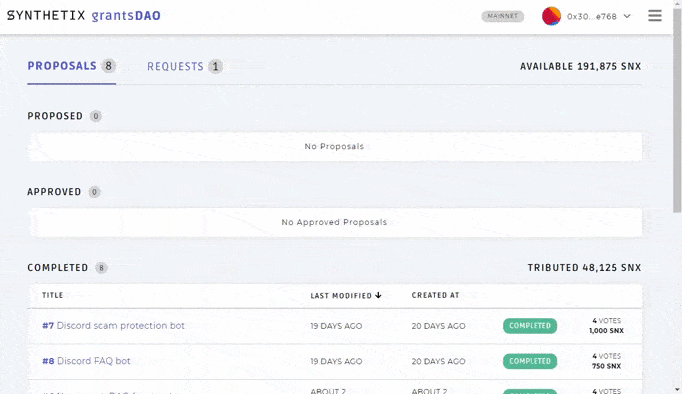

# grantsDAO dApp

This is the code for the new version of the grantsDAO dApp to fund new development for the Synthetix ecosystem.

The following actions are available:

1. View the list of proposals and their current status as well as its detail
2. View the list of requests and their current status as well as its detail
3. Vote or Delete a proposal
4. View the list of Members (Core Contributors and Community Members)
5. Delete an existing member
6. Create a proposal
7. Withdraw `SNX` from the pool

The current supported wallet provider is MetaMask.

## Contracts

- Mainnet: [grantsdao.snx.eth](https://etherscan.io/address/grantsdao.snx.eth)
- Ropsten:
  - grantsDAO Contract: [0x5A3561dfae1C5c91355d4952E48ED8d5264E2D41](https://ropsten.etherscan.io/address/0x5a3561dfae1c5c91355d4952e48ed8d5264e2d41)
  - SNX Mock Token: [0xfb02014edb86e6b08488b56019deb12b5974ceea](https://ropsten.etherscan.io/address/0xfb02014edb86e6b08488b56019deb12b5974ceea)

## TheGraph subgraphs

- Mainnet: https://thegraph.com/explorer/subgraph/protofire/synthetix-grantsdao
- Ropsten: https://thegraph.com/explorer/subgraph/protofire/synthetix-grantsdao-ropsten

## yarn scripts

The grantsDAO dApp uses Gatsby so it supports the basic [Gatsby CLI commands](https://www.gatsbyjs.org/docs/gatsby-cli/): develop, build, serve, info, clean.

### yarn start

This creates a development server which serves the app in localhost:8000 by default.

### yarn build

This generates a production build ready to be deployed.
